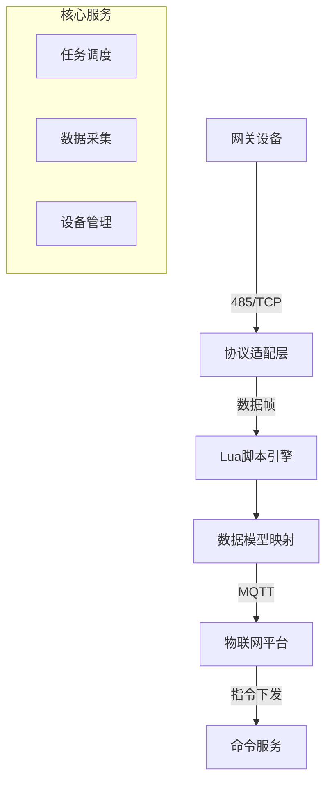

# 系统架构设计

## 架构概览


## 核心模块

### 1. 协议适配层
- **职责**：实现Modbus RTU/TCP基础协议解析
- **特性**：
  - 支持动态加载Lua解析脚本（plugin目录）
  - 插件热更新机制（watchdog模块监控）

### 2. 任务调度引擎
- **组件**：cron v3定时任务
- **功能**：
  - 采集任务优先级队列
  - 断网续传数据缓存（core/cache）

### 3. 设备管理服务
- **实现**：BoltDB持久化存储
- **功能**：
  - 设备注册/注销（api/domain/Device.go）
  - 型号模板管理（plugin目录结构）

## 技术选型
| 组件 | 技术方案 | 选型依据 |
|------|----------|----------|
| 依赖注入 | Uber FX | 轻量级DI框架，适合嵌入式场景 |
| 协议扩展 | Lua 5.4 | 动态加载特性，降低协议变更成本 |
| 消息队列 | Paho MQTT | 完整QoS支持，符合工业物联网要求 |
| 数据存储 | BoltDB | 零配置嵌入式KV存储，适合边缘计算 |

## 运行时架构
```
+----------------+     +-----------------+
|  数据采集服务    |<-->|  MQTT客户端      |
+----------------+     +-----------------+
        ↑                    ↑
+----------------+     +-----------------+
| 任务调度中心     |     | 设备管理服务     |
+----------------+     +-----------------+
        |                    |
+----------------+     +-----------------+
| Lua脚本引擎     |<-->| HTTP API网关     |
+----------------+     +-----------------+
```

## 设计约束
1. 单进程架构：所有服务运行在单一进程（main.go）
2. 资源限制：内存消耗 < 64MB（通过UPX压缩优化）
3. 部署要求：支持ARMv7+架构（build-arm.bat）