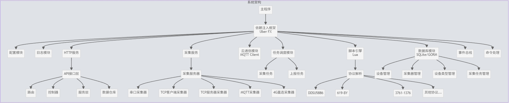
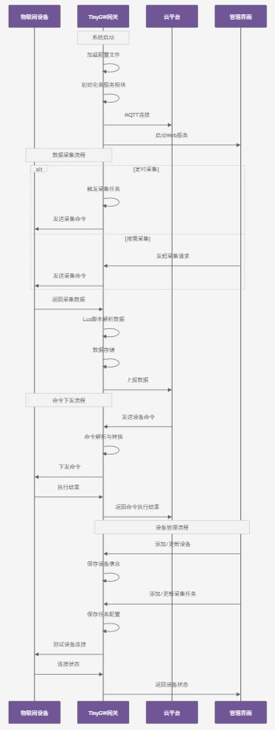
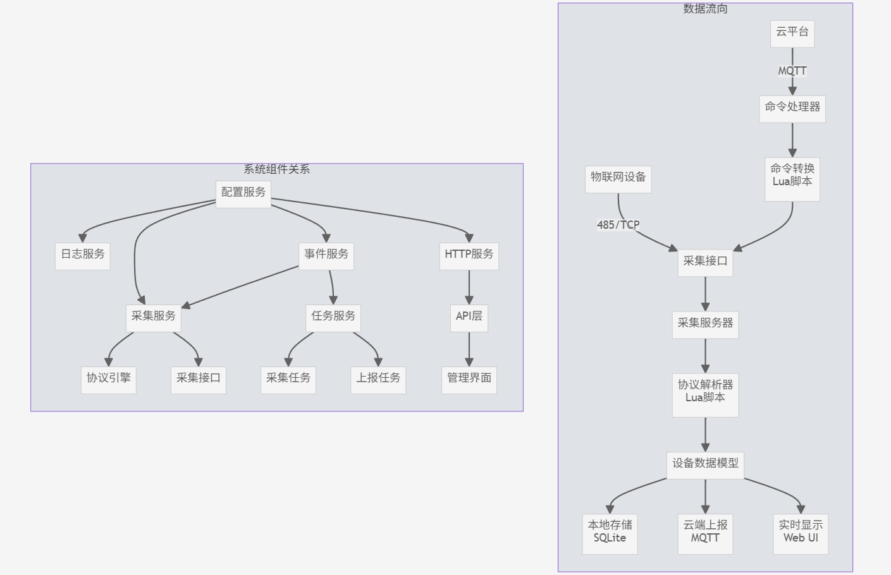

# TinyGW 物联网网关系统

[](https://golang.org/)
[](LICENSE)

TinyGW 是一款功能强大的物联网网关系统，专为工业设备数据采集与处理设计。支持多种工业协议，提供设备接入、数据采集、边缘计算、云端通信等功能，为物联网解决方案提供可靠的边缘层支持。欢迎PR

## TinyGW
### 程序架构图

### 程序流程图（简略）

### 组件关系以及数据流向

## 功能特性

### 设备接入
- **多协议支持**：ModBus RTU/TCP、4G CAT1、国标 3761 等多种工业协议
- **多接口接入**：支持 RS485 串口、TCP 网桥、MQTT、4G直连等多种物理接入方式
- **自动识别**：支持部分设备型号自动识别与注册

### 数据处理
- **实时采集**：支持定时采集与按需采集，采集频率可配置
- **边缘计算**：基于 Lua 脚本引擎的本地化数据处理
- **数据缓存**：支持本地存储与断网续传

### 远程管理
- **远程配置**：云端远程配置网关参数与设备参数
- **远程升级**：支持 OTA 固件升级与设备驱动更新
- **双向通信**：设备命令下发与状态反馈

### 系统功能
- **Web管理界面**：直观的设备管理、任务调度、系统监控界面
- **安全机制**：JWT 认证、TLS 加密、数据校验
- **时钟同步**：NTP 时间同步服务

## 技术架构

### 核心组件
- **开发语言**: Go 1.19+
- **依赖注入**: Uber FX
- **Web框架**: Gin v1.9.1
- **数据存储**: Sqlite
- **任务调度**: Cron v3.0.1
- **MQTT客户端**: Eclipse Paho v1.4.0
- **前端框架**: Vue 3 + Element Plus

### 插件系统
- **协议解析引擎**: Go Lua 1.0.0 (支持动态加载协议解析脚本)
- **设备驱动**: Lua 脚本实现，支持远程更新

### 系统服务
- **数据采集服务**: 多协议设备数据采集
- **云端通信服务**: MQTT 协议与云平台通信
- **命令处理服务**: 设备指令下发与响应处理
- **事件监听服务**: 系统事件与设备事件监听处理

## 快速开始

### 环境要求
- Go 1.19+ 开发环境
- Node.js 16+ 前端开发环境
- Lua 5.4 脚本运行环境
- 支持 RS485/TCP 的硬件接口

### 安装与配置

1. 克隆代码仓库
```bash
git clone https://gitee.com/illusoryNone/tiny-gw.git
cd tiny-gw
```

2. 安装后端依赖
```bash
go mod download
```

3. 安装前端依赖
```bash
cd webapp
npm install --registry=https://registry.npmmirror.com
```

4. 配置系统参数
```bash
# 修改配置文件
cp config/conf.example.yml config/conf.yml
vim config/conf.yml
```

主要配置项:
- `cloud`: 云平台 MQTT 连接配置
- `server`: 网关服务器配置
- `subscribe`: 本地 MQTT 订阅配置
- `serial`: 串口设备配置
- `logger`: 日志系统配置

### 运行与调试

1. 启动后端服务
```bash
go run main.go
```

2. 启动前端开发服务
```bash
cd webapp
npm run dev
```

3. 访问管理界面
```
http://localhost:5173/  # 前端开发服务器
http://localhost:8080/  # 后端 API 及生产环境
```

## 开发指南

### 目录结构
```
tiny-gw/
├── app/              # 应用层
│   ├── api/          # API 接口与路由
│   └── models/       # 数据模型
├── boot/             # 启动模块
├── config/           # 配置文件
├── doc/              # 项目文档
├── pkg/              # 核心包
│   ├── plugin/       # 插件系统
│   ├── service/      # 核心服务
│   └── util/         # 工具函数
├── plugin/           # Lua 脚本插件
└── webapp/           # 前端应用
```

### 添加新设备类型
1. 在 `plugin/` 目录下创建新的设备协议解析脚本
2. 实现必要的接口函数: `GenerateGetRealVariables`、`AnalysisRx` 等
3. 通过 Web 界面或 API 添加设备类型配置

### 扩展功能模块
1. 在 `pkg/service/` 下创建新的服务模块
2. 在 `boot/boot.go` 中注册模块
3. 根据需要实现事件监听或数据处理逻辑

## 部署流程

### 编译打包
```bash
# 编译 Linux 版本
./build-linux.bat

# 编译 ARM 版本（用于嵌入式设备）
./build-arm.bat
```

### 容器部署
```bash
# 构建 Docker 镜像
docker build -t tiny-gw:latest .

# 运行容器
docker run -d \
  --name tiny-gw \
  -p 8080:8080 \
  -p 1883:1883 \
  --device=/dev/ttyS0:/dev/ttyS0 \
  tiny-gw:latest
```

### 系统服务部署
```bash
# 复制系统服务配置
cp tinyGW.service /etc/systemd/system/

# 启用服务
systemctl enable tinyGW
systemctl start tinyGW
```

## 常见问题

### 设备连接问题
- 检查串口权限和波特率设置
- 验证设备地址和通信参数
- 查看系统日志中的通信错误

### 数据采集问题
- 检查协议解析脚本是否匹配设备型号
- 验证采集任务配置与调度时间
- 查看设备响应数据格式

### 系统性能优化
- 调整采集任务间隔，避免高频率采集
- 优化 Lua 脚本执行效率
- 配置适当的数据缓存策略

## 许可证
[MIT License](LICENSE)

## 联系方式
如有问题或建议，请提交 Issue 或通过邮件(804966813@qq.com)联系我们。
微信：

请备注 TinyGW

